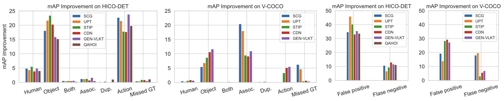
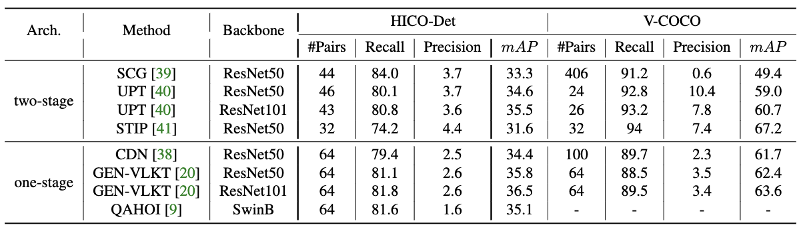
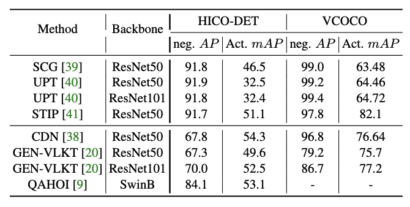

# Diagnosing Human-object Interaction Detectors
Code for "[Diagnosing Human-object Interaction Detectors](toadd)".

Contributed by [Fangrui Zhu](https://fangruizhu.github.io/), [Yiming Xie](https://ymingxie.github.io/), [Weidi Xie](https://weidixie.github.io/), [Huaizu Jiang](https://jianghz.me/).

## Installation
Installl the dependencies.
```
pip install -r requirements.txt
```

## Data preparation

### HICO-DET
Due to the inconsistency in the current evaluation protocol, we remove all `no interaction` annotations from ground truth annotations and predictions. 
There are two precomputed data files regarding HICO-DET. 
```
data
 └─ hicodet
     |─ sum_gts_filtered.pkl # dict: {HOI triplet: number of it in the ground truth} (test set)
     └─ gt_wo_nointer.pkl # ground truth HOIs for all test images
     

```
They can be easily obtained from current HOI benchmarks or you can download them [here](https://drive.google.com/drive/folders/1dia3sJJTbTRaB8S0dHcL1IhXdOCPFuQ3?usp=sharing) and put it under `data/` folder.

### V-COCO
Data files can be obtained from the original repo [here](https://github.com/s-gupta/v-coco). Or you can download files for evaluation [here](https://drive.google.com/drive/folders/1dia3sJJTbTRaB8S0dHcL1IhXdOCPFuQ3?usp=sharing) and put it under `data/` folder.
```
data
 └─ vcoco
     |─ vcoco_test.json
     |─ instances_vcoco_all_2014.json 
     └─ vcoco_test.ids 

```

## Usage

### Standard Evaluation 
Run commands below to get standard $mAP$ results without `no interaction` class. Need to specify `--preds_file` in the config. This file is the output of the HOI detector, whose format can be found in the [examples](https://drive.google.com/drive/folders/1dia3sJJTbTRaB8S0dHcL1IhXdOCPFuQ3?usp=sharing) `data/CDN/preds_wo_nointer.pkl` and `data/CDN/vcoco_r50.pickle`. Or you can follow [CDN](https://github.com/YueLiao/CDN) to save this kind of output.
```
sh eval_hicodet.sh # evaluate on HICO-DET
sh eval_vcoco.sh # evaluate on V-COCO
```

### mAP Improvement

Simply run the following commands to obtain the new mAP after fixing one type of error. You can specify `--fix_type` and `--model_name` while changing the error type and HOI model.

```
sh map_hicodet.sh 
sh map_vcoco.sh
```

### Pair Localization

In order to diagnose the model's performance on pair localization, we need to extract intermediate~(the first stage) results from HOI detectors, i.e. extracting detected pairs before they are passed for interaction classification. Example results can be found [here](https://drive.google.com/drive/folders/1dia3sJJTbTRaB8S0dHcL1IhXdOCPFuQ3?usp=sharing) (`data/CDN/hicodet_pair_preds.pkl`).

Then run commands below to obtain the average number of pairs, recall and precision regarding detected pairs.

```
sh pair_loc_hicodet.sh
sh pair_loc_vcoco.sh
```

### Action Analysis

#### Binary Classification for "no_interaction" class
We compute $AP$ of classifying negative human-object pairs to see if the model is able to give low confidence scores to incorrect localized human-object pairs.
We compute the `no interaction` $AP$ on HICO-DET as it contains `no interaction` annotations. To get the output from HOI detectors, we need to save the classification score belonging to the negative class as $1 - \max_i (p_i)$, where $p_i$ is the classification score of the $i$-th actual action class. Examples can be found [here](https://drive.google.com/drive/folders/1dia3sJJTbTRaB8S0dHcL1IhXdOCPFuQ3?usp=sharing) (`data/CDN/pair_pred_wscore.pkl`). 

With the desired model output, we can obtain the $AP$ of this binary classification problem by running commands below.
```
sh binary_cls_hicodet.sh
```

#### Action mAP on actual classes
For correctly localized pairs, there may be multiple action labels associated with them. We therefore compute the $mAP$ score for the classification over all actual action categories.

In order to get the correct result, one need to save the action score for each predicted triplet, rather than the overall score (human_score * object_score * action_score). Then, running commands below.
```
sh action_map_hicodet.sh
sh action_map_vcoco.sh
```

## Acknowledgment
Some of the code is borrowed from [CDN](https://github.com/YueLiao/CDN) and [v-coco](https://github.com/s-gupta/v-coco).